## Create an map with a route for ergometer space
Create a route with google maps and import it into the ergometer space maps widget

First start google maps and make sure that you are logged in into google

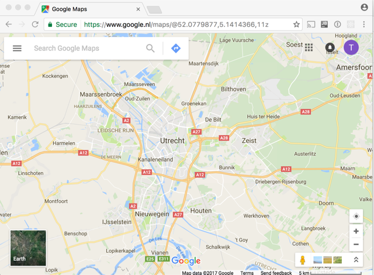


open the menu and start your places

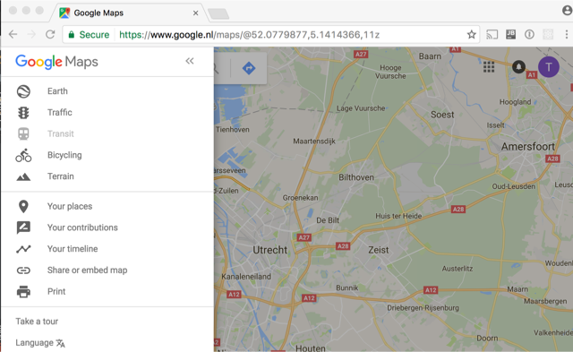

goto maps and choose create map


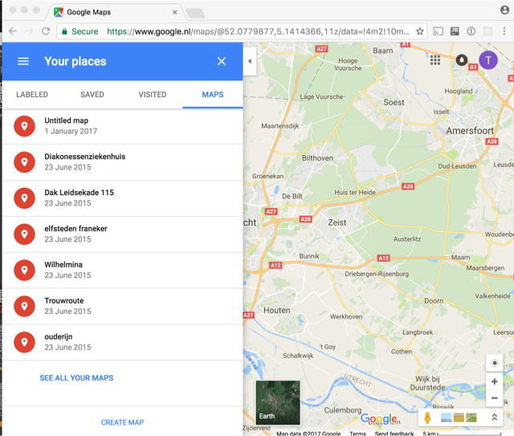

choose the draw line tool

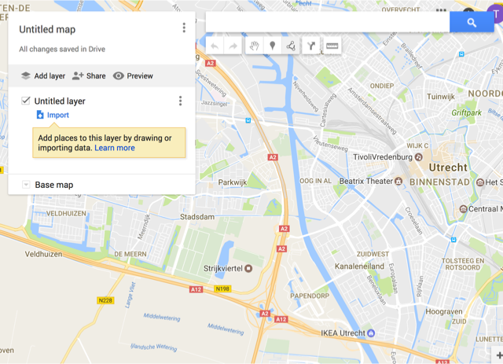


Draw a route. It must sinle set a set of connected lines. Just click on the points where you want the line.
the application does not support closed lines. Just let the end point stop close to the start point if you want a round track.

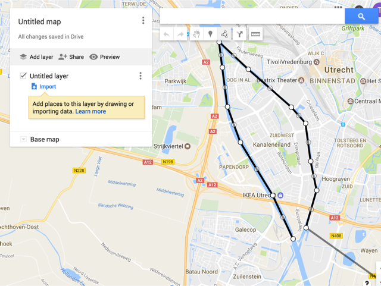


Double click on the last point . a dialog opens , give the route a name and save.

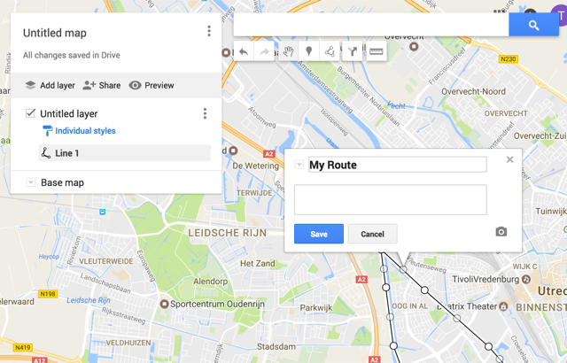


click on the style and increase the line width

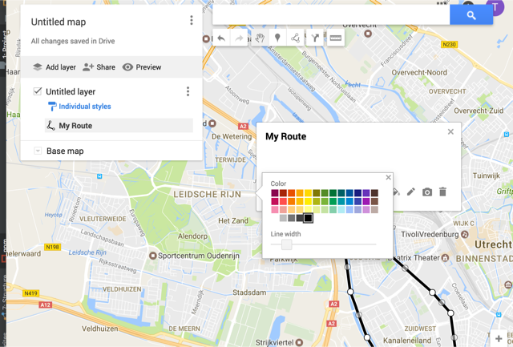


Open the menu on the the untiled layer and chose rename layer

give the layer an name

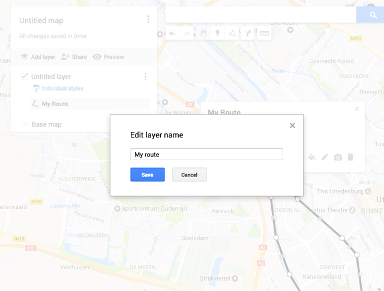


open the top menu and choose export to KML

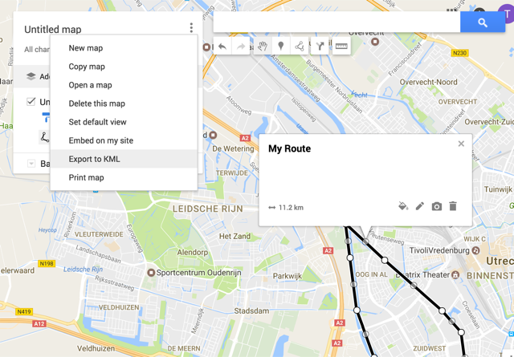

Choose the layer name which you have given
Check the checkbox export to a .KML file

then press download

now you have a file which looks like this:

```xml
<?xml version='1.0' encoding='UTF-8'?>
<kml xmlns='http://www.opengis.net/kml/2.2'>
	<Document>
		<name>My route</name>
		<Placemark>
			<name>My Route</name>
			<styleUrl>#line-000000-4-nodesc</styleUrl>
			<LineString>
				<tessellate>1</tessellate>
				<coordinates>5.104351,52.0521738,0.0 5.0967979,52.0620955,0.0 5.0847816,52.0742308,0.0 5.0799751,52.0823543,0.0 5.0780869,52.0913202,0.0 5.0768852,52.0971206,0.0 5.0876999,52.0908983,0.0 5.1036644,52.0822489,0.0 5.1089859,52.0785565,0.0 5.1108742,52.0699047,0.0 5.1131058,52.0632564,0.0 5.1091576,52.0547072,0.0</coordinates>
			</LineString>
		</Placemark>
		<Style id='line-000000-4-nodesc-normal'>
			<LineStyle>
				<color>ff000000</color>
				<width>4</width>
			</LineStyle>
			<BalloonStyle>
				<text><![CDATA[<h3>$[name]</h3>]]></text>
			</BalloonStyle>
		</Style>
		<Style id='line-000000-4-nodesc-highlight'>
			<LineStyle>
				<color>ff000000</color>
				<width>6.0</width>
			</LineStyle>
			<BalloonStyle>
				<text><![CDATA[<h3>$[name]</h3>]]></text>
			</BalloonStyle>
		</Style>
		<StyleMap id='line-000000-4-nodesc'>
			<Pair>
				<key>normal</key>
				<styleUrl>#line-000000-4-nodesc-normal</styleUrl>
			</Pair>
			<Pair>
				<key>highlight</key>
				<styleUrl>#line-000000-4-nodesc-highlight</styleUrl>
			</Pair>
		</StyleMap>
	</Document>
</kml>
```

go to the ergometer space and click on the tool buton on the map plugin

Click on load file

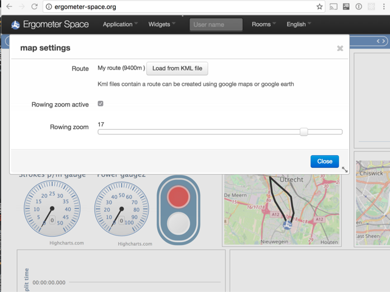


Now the route looks like this:

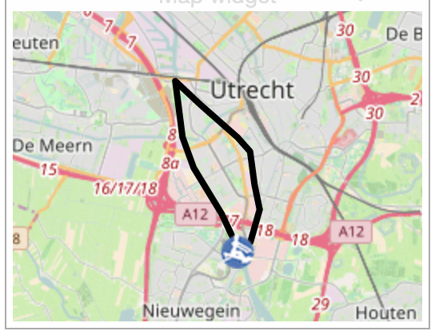

#sharing your creation

The shared maps are stored on github. You can fork te repository an push your own plugin

  https://github.com/tijmenvangulik/Ergometerspace/tree/master/data/maps

You can also send it to me using mail: tijmen@vangulik.org


