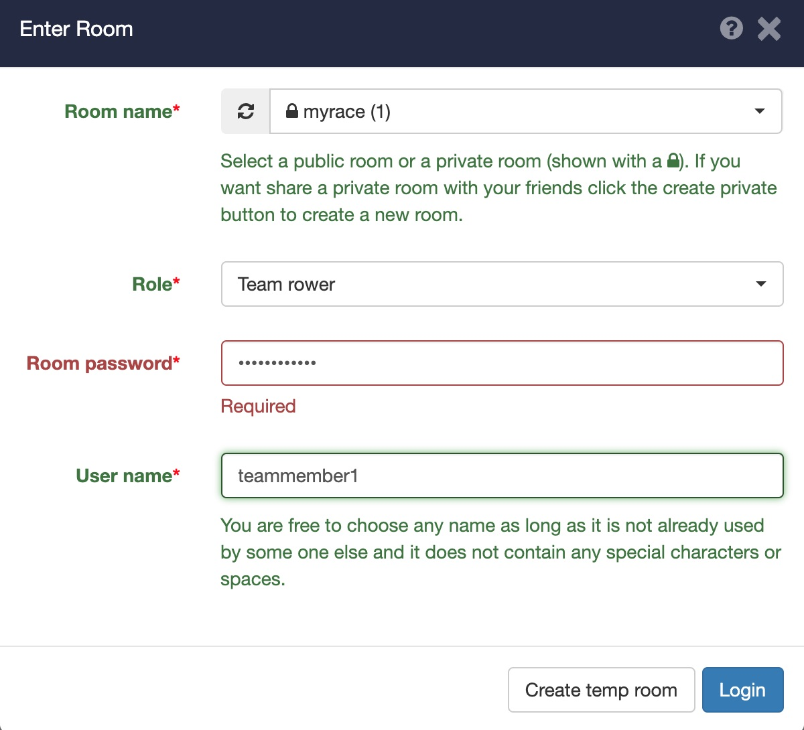

# Introduction

In ergometer space you can row together online. This document describes how to organize a team rowing and how rowers can join teams and start racing.  

Ergometer space is available trough:
* [Website](https://ergometer-space.org/)  (Use a chromium based web browser like Chrome,Edge (The latest))
* Android [download from the play store](https://play.google.com/store/apps/details?id=org.tijmenvangulik.ergometerspace)
* iOS  [Apple app store](https://apps.apple.com/us/app/ergometer-space/id1548193188) 
  
# Roles

There are 4 different roles:

* Solo rower: Rower which does not row in a team and has its own boat.
* Team captain Rower which creates a team and sets the distance.
* Team rower: Rower which joins a team.
* Observer : Watches the race and is not visible in the race widgets.

In this tutorial I assume that the coach organizes the race event. In practice this can be any one.

## Race organizer (coach)
1. Prepare
First make sure that every member knows the room name and password which is required for the login.
Make sure that there is some kind of naming convention for the users names (for example use your actual name) other wise you have no idea to who you are talking.
Every team should have a team captain. Make sure that every team knows who is the team captain and which team they should be joining.

1. First the coach creates a private room
From the room drop down in the menu select "New private room”
Fill in your user name , room name, password. choose “as observer” in the “join room as “ field

Do not logout , when no one is logged in into the room the room is deleted

After login you can start from menu  the "teams & room users" dialog. This dialog shows the the loged in users and the joined teams.

Start the race using the traffic light widget. 

See the chapter [Organize your dashboard](#organize-your-dashboard) to see how to prepare your dashboard.

Use the race widget to see the progress of the race

Use the “values of rowers” widget to check on all the detail data  of the rowers during the race. 

At the end of the race you can see the end times of all the rowers in the "work out log” (open it from the menu)

As organizer you should not invite too many users in the observer role since this may increase the network load and decrease the race quality.

## Team captain

1. Open the app: https://ergometer-space.org/#
2. Open the menu and go to Enter room
3. Select the room/race in the first drop down
4. Select as team captain in the next drop down
5. Type a name for your team
6. Enter the room password
7. Type your user name
8. Press the login button

9. In the next screen you can see other rowers which are logged in and you can see if your team is complete.
The distance which you are about to race must be filled in here. You can still open the same screen after closing it from the menu.

10. Add the traffic light widget and the chat widget (if not already one). 
Read the document [Organize your dashboard](#organize-your-dashboard) on how to connect to your ergometer.

11. You should set the ergometer to “just row” (and not the distance which you are about to row). The boat will go at the average speed of the rowers. At the end of race it is possible that you have a longer distance displayed on your ergomter and that a team member which did row slower has a lower distance.

See the chapter [Organize your dashboard](#Organize your dashboard) to see how to prepare your dashboard for racing.

12. Wait for the traffic light to go green and start rowing.

When your team is complete the boat will start when the team captain starts rowing.

## Team rower

A team rower rows with other rowers in one boat.

1. Open the app: https://ergometer-space.org/#
2. Open the menu and go to Enter room
3. Select the room/race from the first drop down
4. Choose “as team rower” from the second
5. Type in the room password
6. Type in you own user name
7. Press login

8. After this the following team screen opens.
Do not close it. Wait for your team captain to login. Once he is logged in select the green join button.

9. Set your ergometer to just row. (and not the distance which you are about row) The boat will go at the average speed of the rowers. At the end of race it is possible that you have a longer distance displayed on your ergomter and that a team member which did row slower has a lower distance.

In the race widget you see your team and how many team members are joined and the position of the boat. 

10. Add the traffic light widget and the chat widget (if not already one). 

See the chapter [Organize your dashboard](#organize-your-dashboard) to see how to prepare your dashboard for racing.
  
Read the document [Connecting to the ergometer](connection.md) on how to connect to your ergometer.

11. Wait for the traffic light to go green and start rowing

## Coach or audience

1. Open the app: https://ergometer-space.org/#
2. Open the menu and go to Enter room
3. Select the room/race from the first drop down
4. Choose “as observer” from the second
5. Type in the room password
6. Type in you own user name
7. Press login

Now you can watch the race or chat with other rowers.

See the chapter [Organize your dashboard](#Organize your dashboard) to see how to prepare your dashboard.

Enjoy watching the race.

## Organize your dashboard

For team racing the are some important widgets.

1. Race widget
2. Chat widget.
3. Traffic light. 
4. Values of rowers

The race widget is standard visible the other widgets should be added by your selves.
To add widgets click on the edit icon in the top right corner:

Then click on the + button in the left corner to open the widget menu. Now Open the Row together section and at least add the Chat widget and the Traffic light widget:

Coaches can also add the value of rowers widget to see the race details.

The widget with the 3d rower costs a lot of process power/energy. If you do not use it, it is better to close it.

Widgets in detail:

## Race widget

In this widget you can see other teams and the progress of race. The animated rower is the actual position of the rower. In gray in the back ground you see the projected position as if you and the other rower had started at exactly the same time. This makes it possible to race against some one which has started a bit earlier or later.

## Chat widget

Here you can chat with any one in the same room. Click on the speaker button to activate audio. You can check the "to team only" to send messages to only your own team. (This only works if you have joined a team)

## Traffic light widget

The traffic light is usefull for starting at the same time. Clicking on the traffic light will open a dialog which enables you to start the traffic light. The traffic light has a count down. 

## Values of rowers widget

See the details of the rowers. This is useful for the coach. Not all values are directly displayed. In the dashboard edit mode you can configure which columns will be shown. 

# Trouble shooting room connections

From the menu you can start the "teams & room users" dialog. It shows all the users in the room. If a user has joined but is not correctly connected due to connection problems it is shown in the list with the text "not connected!". There are a view possible errors
  - not connected! old version of the app.
    This user should upgrade to the latest version (at least 3.5.0).
  - Connected via server, no audio.
    The user is connected, you can row together. This happens your network does not support direct connections the communication goes via the central server. This can sometimes result in a bit slower updates.  Audio is not supported for this user. Using a wifi instead of a mobile connection may help.
  - not connected!
    You can not connect at all maybe the network it selves is down. Check your wifi/network cables or mobile network provider.

As alternative you could also create a room with the option "backwards compatible room" box checked. This kind of room has less problems with network connections. The disadvantage of these kind of rooms are that networking is much slower and it is less scalable (resulting slower updates)
