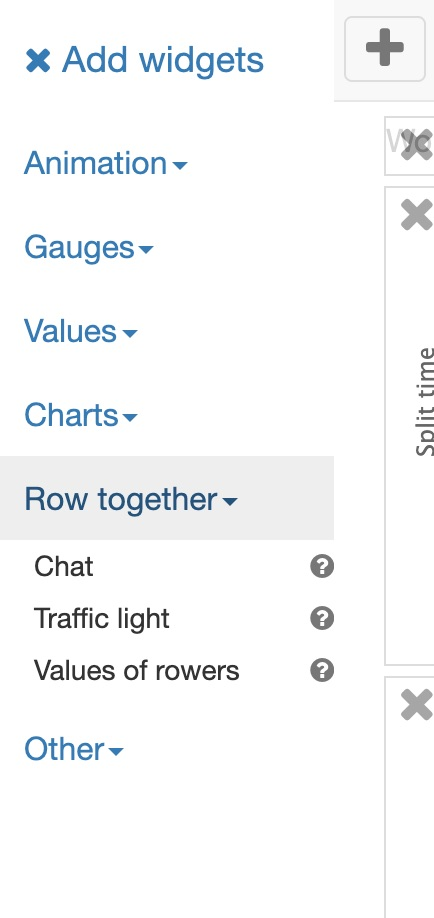

# Introduction

In ergometer space you can row together online. This document describes how to organize a team rowing and how rowers can join teams and start racing.  

Ergometer space is available trough:
* [Website](https://ergometer-space.org/)  (Use a chromium based web browser like Chrome or Edge)
* Android [download from the play store](https://play.google.com/store/apps/details?id=org.tijmenvangulik.ergometerspace)
* iOS  [Apple app store](https://apps.apple.com/us/app/ergometer-space/id1548193188) 

# Roles

There are 4 different roles:

* Solo rower: Rower which does not row in a team and has its own boat.
* Team captain: When you are the first team member which logs in you will become the team captain. A team captain controls the distance and the team will be removed when the team member logs off.
* Team rower: Rower which joins a team. Team rowers row in one boat. The boat has the average speed of alle the rowers.
* Observer : Watches the race and is not visible in the race widgets. Race results will be included in the workout log of the observer.

# Race organizer

If you have many teams and and are different races which start at the same time you use different rooms for every race. You should not create too many rooms because the server has a limit of 40 rooms.

Team boats will go at the average speed of the rowers. This also means that no matter how many rowers there are in a team they can compete against each other.

The race organizer will send al link (url) to every one who is going to attend. In your mail / app you have to give some tell the users that to do with the link. Some thing like this:

    Please open the link in a chromium based browser (for example chrome or edge) or a native app ergometer-space installed on the phone/computer. 
    When you use a native app you have to copy the link, open the Direct login link from the menu and paste the link into the text box. Press login to login.

## creating links
To create a link go in the menu to Direct login link and then go to the tab create. 

All the properties on how the room is created are stored in the link. When you change a property like for example the password or a login type you have to send the the link to the user(s). If for example one of your users still uses the old link things may go wrong because if that user uses the link with an old room password other users will not be able to login because they use the new password. It is best to not change these properties and when you do change the name of the room when you resend a changed url to all your users.

Fill in:
* Room name: (use a unique name. )
* Room password: (This is the password for the room, you should NOT give a different password to every user.)
* User name. Send every user a different link with a unique user name.
* Login type: It is not possible to change your login type. It is possible to join another team, but team captains can not join another team because they are the owner of the team. To do this you have to send multiple links or the users can log off/on to get a different role.
* Include dashboard: Check this if you want to send a prepared dashboard to the users. A observer may want to see different things than a rower. When you use a map for the race you may want to include the map widget. The widget positions in the current dashboard will be exported. (not all the properties of the widgets)
* Hidden room: Your private room will not be shown publicly to other users. Users can only login using a Direct login link and not from the menu. Checking this option will make it a bit safer. If some one knows your room name he could create a room with the same name just before you with a different password. You and your users will not be able to login any more and you have to create new links. With this option no one else will see and know your room name.
* Welcome text: Text which is shown before the user logs in.
* Map: Url to a kml file which contains the map. This option is nice if you want do a race which is normally on the water online using ergometers. See the topic  [maps](Maps/index.md)
  
Press create to make a link. You can modify/multiply the link in an text editor/spreadsheet afterwards. But keep in mind that you should not use special characters in a link. Normal spaces are also not allowed. Editing the link wrongly and they will not work any more. 

* The link includes the version of the app in which you have created the link. The users to which you send the link should be on the same version or above.

Example urls which you can send to users. The example includes a dashboard and a map
* Solo Rower:  [link](https://ergometer-space.org?action=doLogin&version=3.5.3&roomName=Room1&password=room1password&userName=Rower1&loginType=SoloRower&map=https://tijmenvangulik.github.io/Ergometerspace/data/maps/TheBoatRace.kml&dashboard=%7B%22widgets%22:%5B%7B%22name%22:%22TrainingDataWidget%22,%22x%22:0,%22y%22:0,%22width%22:3,%22height%22:1,%22percentageChartVisible%22:true,%22valueFontSize%22:100,%22sparkLineVisible%22:true%7D,%7B%22name%22:%22MapWidget%22,%22x%22:2,%22y%22:8,%22width%22:2,%22height%22:10,%22valueFontSize%22:100%7D,%7B%22name%22:%22RaceTrackWidget%22,%22x%22:0,%22y%22:1,%22width%22:3,%22height%22:7,%22valueFontSize%22:100%7D,%7B%22x%22:0,%22y%22:8,%22width%22:2,%22height%22:10,%22valueFontSize%22:100,%22name%22:%22chatWidget%22%7D,%7B%22x%22:3,%22y%22:0,%22width%22:1,%22height%22:8,%22valueFontSize%22:100,%22name%22:%22TrafficLightWidget%22%7D%5D%7D&welcome=Welcome%20to%20the%20race)
* Team Rower:  [link](https://ergometer-space.org?action=doLogin&version=3.5.3&roomName=Room1&password=room1password&userName=Rower1&teamName=Team1&loginType=TeamRower&distance=1000&map=https://tijmenvangulik.github.io/Ergometerspace/data/maps/TheBoatRace.kml&dashboard=%7B%22widgets%22:%5B%7B%22name%22:%22TrainingDataWidget%22,%22x%22:0,%22y%22:0,%22width%22:3,%22height%22:1,%22percentageChartVisible%22:true,%22valueFontSize%22:100,%22sparkLineVisible%22:true%7D,%7B%22name%22:%22MapWidget%22,%22x%22:2,%22y%22:8,%22width%22:2,%22height%22:10,%22valueFontSize%22:100%7D,%7B%22name%22:%22RaceTrackWidget%22,%22x%22:0,%22y%22:1,%22width%22:3,%22height%22:7,%22valueFontSize%22:100%7D,%7B%22x%22:0,%22y%22:8,%22width%22:2,%22height%22:10,%22valueFontSize%22:100,%22name%22:%22chatWidget%22%7D,%7B%22x%22:3,%22y%22:0,%22width%22:1,%22height%22:8,%22valueFontSize%22:100,%22name%22:%22TrafficLightWidget%22%7D%5D%7D&welcome=Welcome%20to%20the%20race)
* Observer: [link](https://ergometer-space.org?action=doLogin&version=3.5.3&roomName=Room1&password=room1password&userName=Rower1&loginType=SoloRower&map=https://tijmenvangulik.github.io/Ergometerspace/data/maps/TheBoatRace.kml&dashboard=%7B%22widgets%22:%5B%7B%22name%22:%22MapWidget%22,%22x%22:2,%22y%22:7,%22width%22:2,%22height%22:10,%22valueFontSize%22:100%7D,%7B%22name%22:%22RaceTrackWidget%22,%22x%22:0,%22y%22:0,%22width%22:2,%22height%22:9,%22valueFontSize%22:100%7D,%7B%22x%22:3,%22y%22:0,%22width%22:1,%22height%22:7,%22valueFontSize%22:100,%22name%22:%22chatWidget%22%7D,%7B%22x%22:2,%22y%22:0,%22width%22:1,%22height%22:7,%22valueFontSize%22:100,%22name%22:%22TrafficLightWidget%22%7D,%7B%22x%22:0,%22y%22:9,%22width%22:2,%22height%22:8,%22valueFontSize%22:100,%22name%22:%22RaceValuesWidget%22%7D%5D%7D&welcome=Welcome%20to%20the%20race)

After login you can start from menu  the "teams & room users" dialog. This dialog shows the the logged in users and the joined teams.

Start the race using the traffic light widget. 

See the chapter [Organize your dashboard](#organize-your-dashboard) to see how to prepare your dashboard.

Use the race widget to see the progress of the race

Use the “values of rowers” widget to check on all the detail data  of the rowers during the race. 

At the end of the race you can see the end times of all the rowers in the "work out log” (open it from the menu)

As organizer you should not invite too many users in the observer role since this may increase the network load and decrease the race quality.

# Observers

Please open the link which is given to you in a chromium based browser (for example chrome or edge) or a native app ergometer-space installed on the phone/computer. 
When you use a native app you have to copy the link, open the Direct login link from the menu and paste the link into the text box. Press login to login.

Now you can watch the race or chat with other rowers.

See the chapter [Organize your dashboard](#Organize your dashboard) to see how to prepare your dashboard.

Enjoy watching the race.

# Solo rowers

Please open the link which is given to you in a chromium based browser (for example chrome or edge) or a native app ergometer-space installed on the phone/computer. 
When you use a native app you have to copy the link, open the Direct login link from the menu and paste the link into the text box. Press login to login.

After the login connect the ergometer and set your ergometer to the same distance.

See the chapter [Organize your dashboard](#Organize your dashboard) to see how to prepare your dashboard for racing.

# Team rowers

Please open the link which is given to you in a chromium based browser (for example chrome/edge/brave/opera) or a native app ergometer-space installed on the phone/computer. 
When you use a native app you have to copy the link, open the Direct login link from the menu and paste the link into the text box. Press login to login.

When you are the first team member which logs in you will become the team captain. A team captain controls the distance and the team will be removed when the team member logs off.

You should set the ergometer to “just row” (and not the distance which you are about to row). The boat will go at the average speed of the rowers. At the end of race it is possible that you have a longer distance displayed on your ergometer and that a team member which did row slower has a lower distance.

See the chapter [Organize your dashboard](#Organize your dashboard) to see how to prepare your dashboard for racing.

## Organize your dashboard

For team racing the are some important widgets.

1. Race widget
2. Chat widget.
3. Traffic light. 
4. Values of rowers

The race widget is standard visible the other widgets should be added by your selves.
To add widgets click on the edit icon in the top right corner:

Then click on the + button in the left corner to open the widget menu. Now Open the Row together section and at least add the Chat widget and the Traffic light widget:

Coaches can also add the value of rowers widget to see the race details.

The widget with the 3d rower costs a lot of process power/energy. If you do not use it, it is better to close it.

Widgets in detail:

## Race widget

In this widget you can see other teams and the progress of race. The animated rower is the actual position of the rower. In gray in the back ground you see the projected position as if you and the other rower had started at exactly the same time. This makes it possible to race against some one which has started a bit earlier or later.

## Chat widget

Here you can chat with any one in the same room. Click on the speaker button to activate audio. You can check the "to team only" to send messages to only your own team. (This only works if you have joined a team)

## Traffic light widget

The traffic light is usefull for starting at the same time. Clicking on the traffic light will open a dialog which enables you to start the traffic light. The traffic light has a count down. 

## Values of rowers widget

See the details of the rowers. This is useful for the coach. Not all values are directly displayed. In the dashboard edit mode you can configure which columns will be shown. 

# Trouble shooting room connections

From the menu you can start the "teams & room users" dialog. It shows all the users in the room. If a user has joined but is not correctly connected due to connection problems it is shown in the list with the text "not connected!". There are a view possible errors
  - not connected! old version of the app.
    This user should upgrade to the latest version (at least 3.5.0).
  - Connected via server, no audio.
    The user is connected, you can row together. This happens your network does not support direct connections the communication goes via the central server. This can sometimes result in a bit slower updates.  Audio is not supported for this user. Using a wifi instead of a mobile connection may help.
  - not connected!
    You can not connect at all maybe the network it selves is down. Check your wifi/network cables or mobile network provider.

As alternative you could also create a room with the option "backwards compatible room" box checked. This kind of room has less problems with network connections. The disadvantage of these kind of rooms are that networking is much slower and it is less scalable (resulting slower updates)
