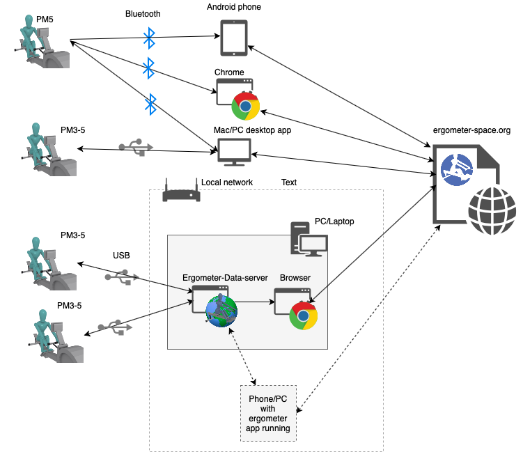

# Connect to the ergometer

There are two ways too connect to the website to the ergometer
* Install the Ergometer Data server
* Web bluetooth

## Ergometer Data server
Go to the download menu and download and install the Ergometer Data server  
Compatible with:
* Windows
* Mac OS X 10.11 and below (so not the latest 10.12)

The server can be used to connect multiple ergometers to one or more browsers.

## Use (web) bluetooth
Selecting the ergometer connection menu the connection type "Bluetooth (PM5)".
Close the dialog and click on the pair ergometer in the main menu bar.

Compatible with:
* android (native support)
* Desktop browser chrome with 
  - MacOS X
  - Android
  - Chrome OS
  - Linux

In the near future windows will be supported in chrome. I expect that other browsers will also add support. 
Limitations:

  - Use https
  - You can not post a high score (due to the problem that I can not protect the java script code)
  
To check support:
 https://github.com/WebBluetoothCG/web-bluetooth/blob/master/implementation-status.md

