<!-- Main -->

<!-- One -->
<section id="one">
	

		<header class="major">
			<h2>Introduction</h2>
		</header>

Ergometer-space is an ergometer rowing app for concept2 PM3-5. The app support blue tooth for PM5 and USB for PM3-5 and can be used online and offline. 

	

</section>

<!-- Two -->
<section id="two" class="spotlights">
	<section>
		

			
		

		

			

				<header class="major">
					<h3>Platform</h3>
				</header>
				<ul>
				  <li>Works on chromium based browsers (Chrome, Edge, Brave etc)
				  <li>Install the web app as offline app straight from the browser (even on Android).
  				  <li>Install it as native app on android and iOS from the store. 
				  <li>Connect to the ergometer using USB or bluetooth.
				</ul>
			

		

	</section>
	<section>
		

			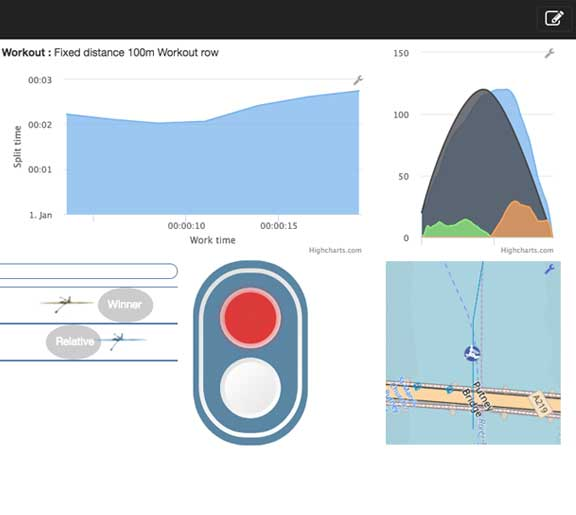
		

		

			

				<header class="major">
					<h3>Dashboard</h3>
				</header>
				
Create your own dashboard with values and gauges widgets You can choose from more than 30 widgets.

			

		

	</section>
	<section>
		

			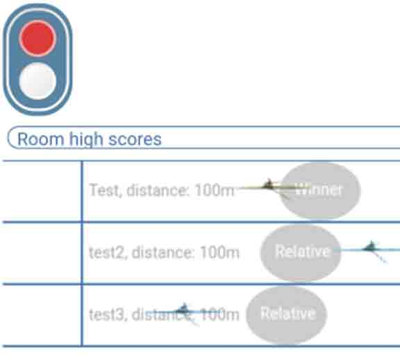
		

		

			

				<header class="major">
					<h3>Row together</h3>
				</header>
				
Rowing together online. (Alone or as a team in one boat) Connect to an ergometer room and share your session

<ul>
   <li> See each other and projected positions (works with the race,map,vr widgets,power curve)</li>
   <li> Publish a high score</li>
   <li> Chat using text or audio</li> 
   <li> Traffic light.</li>
   <li> Login as observer to watch a race and collect the end times.</li>  
   <li> Row together as one team and race against other teams</li>
</ul>
			

		

	</section>
	<section>
		

			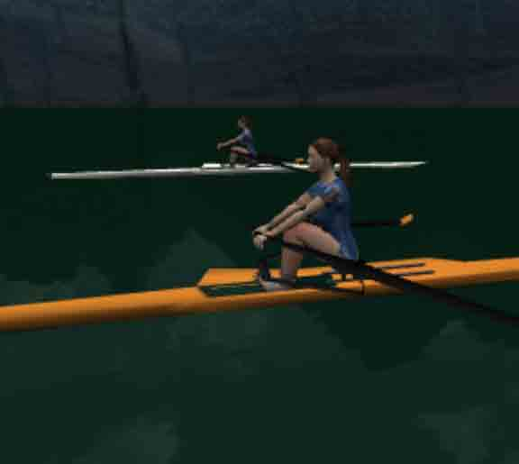
		

		

			

				<header class="major">
					<h3>3D / VR</h3>
				</header>
				
Row in 3D or using an VR headset. Rowing in VR works best when you install the app on an android phone and you use a vr headset.

			

		

	</section>
	<section>
		

			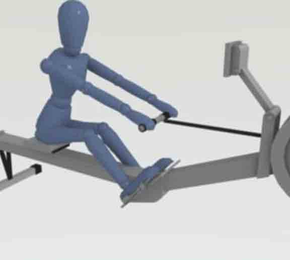
		

		

			

				<header class="major">
					<h3>Free and full privacy</h3>
				</header>
				
Ad free and your data stays private. (This app is made for fun, not for making money). Your data stays as much as possible inside your browser. Only data which you share is send to other users. See the privacy page for more info.

			

		

	</section>
	<section>
		

			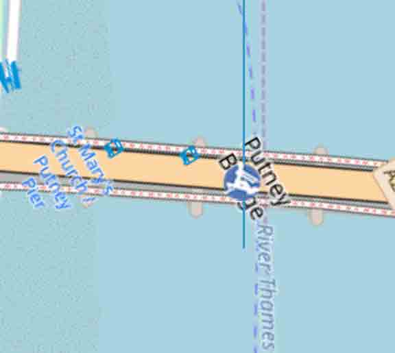
		

		

			

				<header class="major">
					<h3>Map</h3>
				</header>
				
You can load your own map with a predefined course and show your rowing position and the position of other rowers on the map. This feature can help you preparing for a race.

			

		

	</section>
	<section>
		

			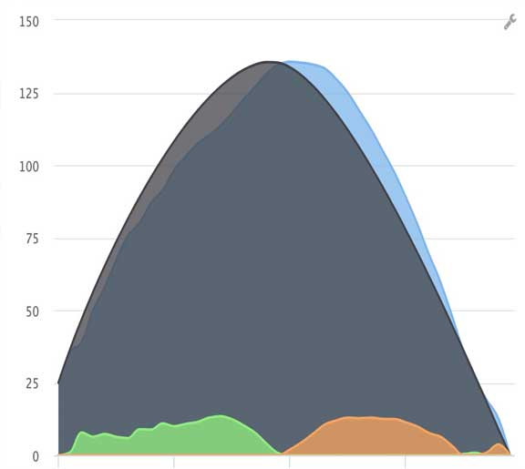
		

		

			

				<header class="major">
					<h3>Power curve</h3>
				</header>
				

<ul>
<li>View your power curve and compare it with an base curve.</li>
<li>Make your own base curve</li> 
<li>Live share your power curve with other users and try to match your curve with the other rower. This way you can your train together over the internet while.</li>
</ul>				
				

			

		

	</section>
    <section>
		

			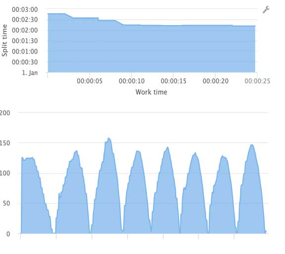
		

		

			

				<header class="major">
					<h3>History</h3>
				</header>
				<ul>
<li>View detailied history of your race</li>
<li>The details of a race can be shown in an history widget</li>
<li>Even power curves are stored.</li>
<li>Export training data inluding power curves to both json and csv. Imports are json only. With csv export you can view your data in excel.</li> 
</ul>	
			

		

	</section>
	<section>
		

			
		

		

			

				<header class="major">
					<h3>Pace boat</h3>
				</header>
				
Race agains a pace boat which rows a preset speed or a previous  training in you history. This way you can race against your selves or a training of some one else.

			

		

	</section>
	<section>
		

			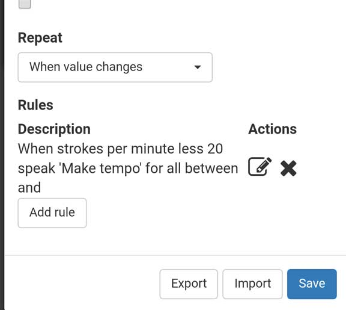
		

		

			

				<header class="major">
					<h3>Notification</h3>
				</header>
				
Get warnings when user defined stroke value limits are exceeded.The advisor widgets can speak out the advice.

			

		

	</section>
	<section>
		

			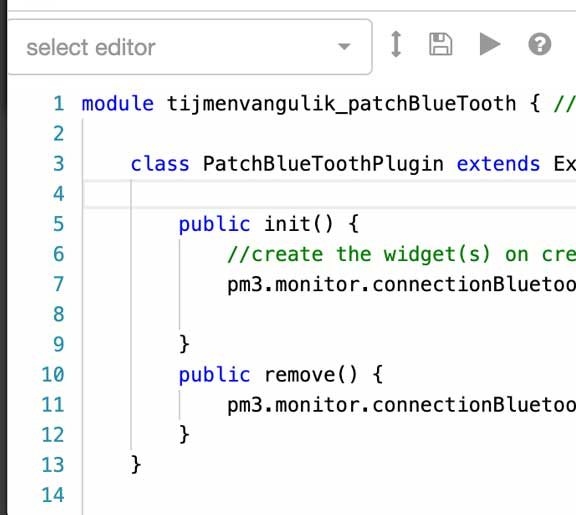
		

		

			

				<header class="major">
					<h3>Plugins</h3>
				</header>
				
Install third party Plugins or create your own plugin to extend the app. Plugins can be created on the ergometer space website.

			

		

	</section>
	<section>
		

			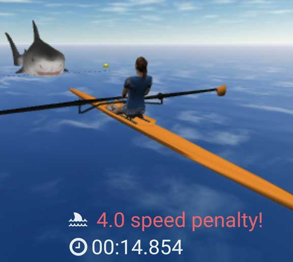
		

		

			

				<header class="major">
					<h3>Shark game</h3>
				</header>
				
Test your condition in the 3d shark game

			

		

	</section>
	<section>
		

			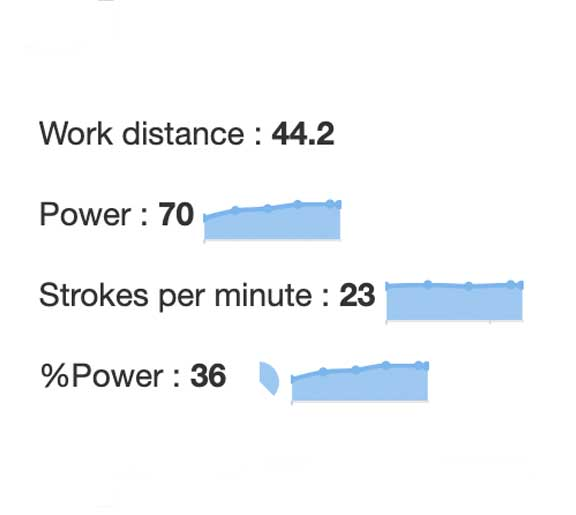
		

		

			

				<header class="major">
					<h3>Spark lines</h3>
				</header>
				
Spark lines and mini pi charts in the value widgets to quickly see trends.

			

		

	</section>
	<section>
		

			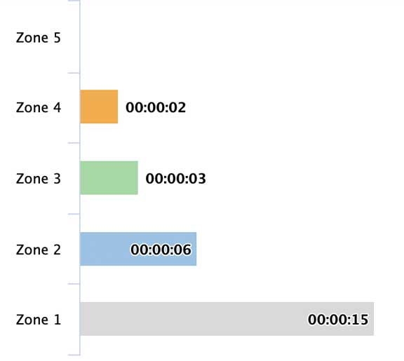
		

		

			

				<header class="major">
					<h3>Heart rate</h3>
				</header>
<ul>
<li>Connect to a blue tooth heart rate device or include the heart rate data from the concept2 performance monitor</li>
<li>Show your heart rate as percentage of the total max rate or as graph in a heart rate zone widget. The zones and max heart rate are configurable.</li>
</ul>
			

		

	</section>
	<section>
		

			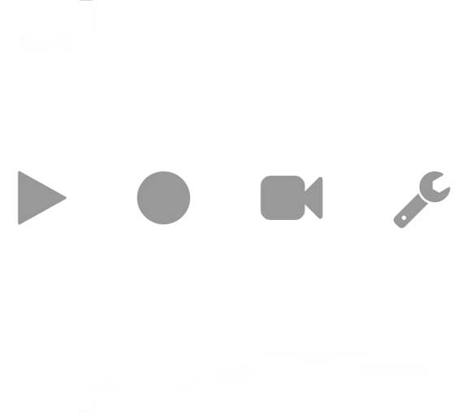
		

		

			

				<header class="major">
					<h3>Record and replay</h3>
				</header>
				
Record and replay of all the ergometer data plus an optional video. The import/export function allows you to give this data to a coach for further analysis.

			

		

	</section>
	
</section>

<section id="two">
    
                
    	 <a href="{{site.webSiteLink}}" class="button">Go to the ergometer-space app</a>                
    

</section>
